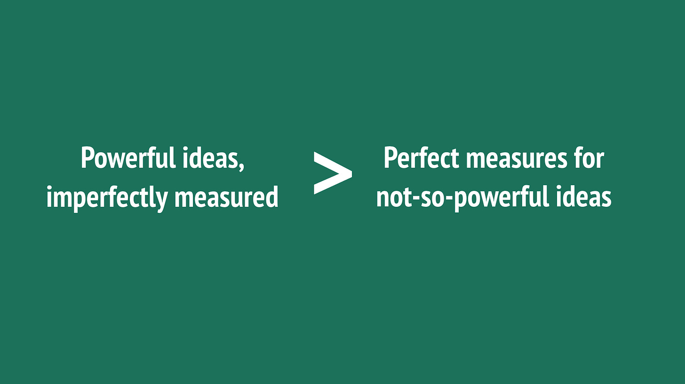

Powerful ideas, imperfectly measured, are more useful than perfect measures for not-so-powerful ideas.

Example:

The goal of your business is to transform how other companies do business. "That happens outside our product, we can't measure it," says the data scientist. But *is* it impossible to measure? I would argue otherwise. [How to Measure Anything: Finding the Value of Intangibles in Business by Douglas W. Hubbard](https://www.amazon.com/How-Measure-Anything-Intangibles-Business-ebook/dp/B00INUYS2U) is a good start. One option might a regular cadence of structured interviews focusing on 2nd order impacts. While we're at it, we might measure other powerful ideas like trust and flexibility.

Another example:

We hypothesize that thoughtfully written content acquires customers more effectively. The powerful ideas is the idea that (we think) it is worth spending time to write good (8+ out of 10 level) content! While content quality might be subjective, it would be a mistake to not try to measure this and test our hypothesis. As a start, we could classify each of the existing posts on our site. Even a coarse-grained categorization scheme can work. And *then* look at customer acquisition, and downstream retention.

Don't skip your powerful ideas. Get them down. Map them out. Consider minimally viable measurement. Reducing uncertainty a small amount for a powerful idea is more valuable than being 100% certain about a generic ideas.